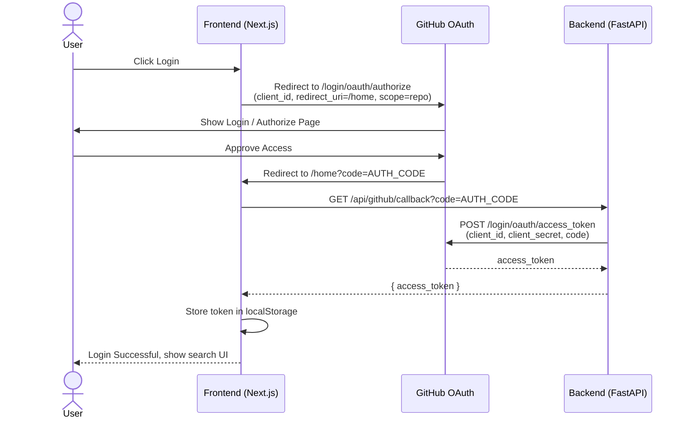
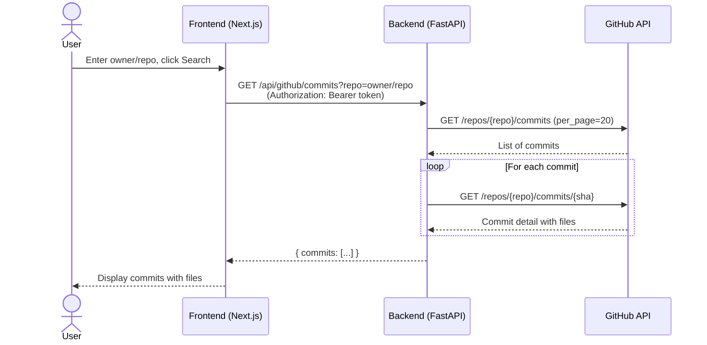
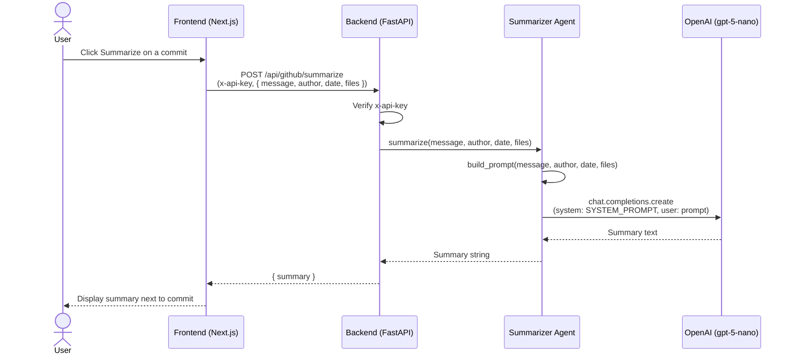

# Architecture

## Login Flow

```mermaid
sequenceDiagram
    actor User
    participant UI as Frontend (Next.js)
    participant GitHub as GitHub OAuth
    participant API as Backend (FastAPI)

    User->>UI: Click Login
    UI->>GitHub: Redirect to /login/oauth/authorize<br/>(client_id, redirect_uri=/home, scope=repo)
    GitHub->>User: Show Login / Authorize Page
    User->>GitHub: Approve Access
    GitHub->>UI: Redirect to /home?code=AUTH_CODE
    UI->>API: GET /api/github/callback?code=AUTH_CODE
    API->>GitHub: POST /login/oauth/access_token<br/>(client_id, client_secret, code)
    GitHub-->>API: access_token
    API-->>UI: { access_token }
    UI->>UI: Store token in localStorage
    UI-->>User: Login Successful, show search UI
```

## Search Flow

```mermaid
sequenceDiagram
    actor User
    participant UI as Frontend (Next.js)
    participant API as Backend (FastAPI)
    participant GitHub as GitHub API

    User->>UI: Enter owner/repo, click Search
    UI->>API: GET /api/github/commits?repo=owner/repo<br/>(Authorization: Bearer token)
    API->>GitHub: GET /repos/{repo}/commits (per_page=20)
    GitHub-->>API: List of commits
    loop For each commit
        API->>GitHub: GET /repos/{repo}/commits/{sha}
        GitHub-->>API: Commit detail with files
    end
    API-->>UI: { commits: [...] }
    UI-->>User: Display commits with files
```

## Summarize Flow

```mermaid
sequenceDiagram
    actor User
    participant UI as Frontend (Next.js)
    participant API as Backend (FastAPI)
    participant Agent as Summarizer Agent
    participant LLM as OpenAI (gpt-5-nano)

    User->>UI: Click Summarize on a commit
    UI->>API: POST /api/github/summarize<br/>(x-api-key, { message, author, date, files })
    API->>API: Verify x-api-key
    API->>Agent: summarize(message, author, date, files)
    Agent->>Agent: build_prompt(message, author, date, files)
    Agent->>LLM: chat.completions.create<br/>(system: SYSTEM_PROMPT, user: prompt)
    LLM-->>Agent: Summary text
    Agent-->>API: Summary string
    API-->>UI: { summary }
    UI-->>User: Display summary next to commit
```
